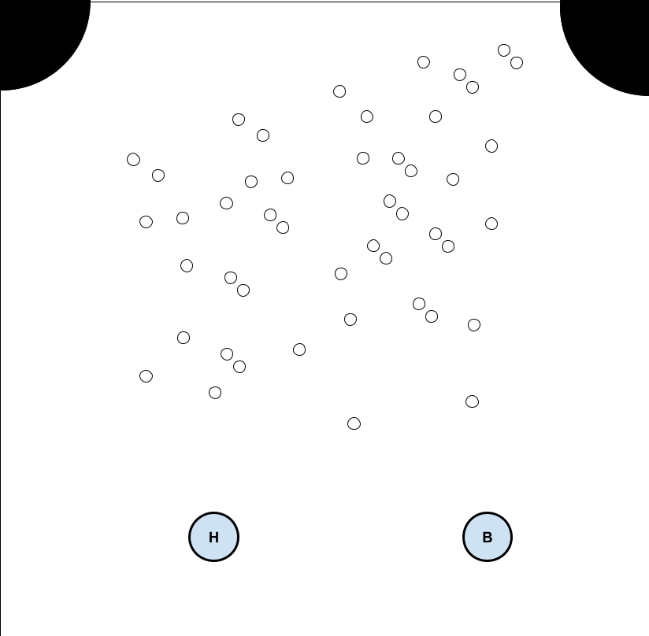

PCD a.y. 2024-2025 - ISI LM UNIBO - Cesena Campus

# Assignment #01 -  Poool Game

v0.9.0-20260316

The assignment is about 
designing and developing a game called `Poool`. 
- The environment of the game is a delimited  bidimensional space called `board`, including a high number of small balls, that can move and bounce, either against the border or each other. We consider purely elastic collisions, and friction force, so that a moving ball stops after a while.
- Besides the small balls, there are two further balls, slightly bigger: one is controlled by the human player and one is controlled by a bot. 
- At the top of the board, in the corners, there are two circles representing holes. 

    

The objective of the game for the players (human the bot) is to kick the small-balls in the holes, by using their own balls. 
- When a player puts a small ball in a hole, his/her score is incremented by one. 
- The game ends when all the small-balls have been put in the holes and the winner is the player with the biggest score. 
- The game ends also if/when the ball of a player goes in a hole. In that case, the winner is the other player, in spite of the score.
 
The objective of the assignment is to design and develop a concurrent version of `Pooo`, in two different versions:
1)  one based on Java **multithreaded programming**, using only default/platform threads;
2)  a variant applying **Task-based** approach, using Java **Executor Framework**, where useful.

The `assignment-01`includes some code examples that could be used as a starting point.

Remarks:
- The concurrent program should be designed according the principles studied during the course, promoting modularity, encapsulation as well as performance, reactivity. 
- For active components/thread interaction, monitors must be used, with your own implementation (no lib support)
- The behaviour of the bot is not meant to be smart, could be any.
- For every other aspect not specified, students are free to choose the best approach for them.

Beside the source code, a brief report should be produced, including:
- A brief analsysis of the problem, focusing in particular aspects that are relevant from concurrent point of view.
- A description of the adopted design, the strategy and architecture.
- A description of the behaviour of the system using one or multiple Petri Nets, choosing the proper level of abstraction.
- Performance tests, to analyse and discuss the performance of the programs (for each version) compared to the sequential version
- Verification of the program or some parts of it, defining proper simplified models, using model-checking and JPF in particular. 

### The deliverable

The deliverable must be a zipped folder `Assignment-01`, to be submitted on the course web site, including:  
- `src` directory with sources
- `doc` directory with a short report in PDF (`report.pdf`). 

